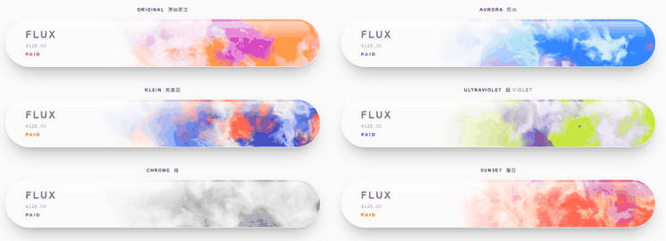
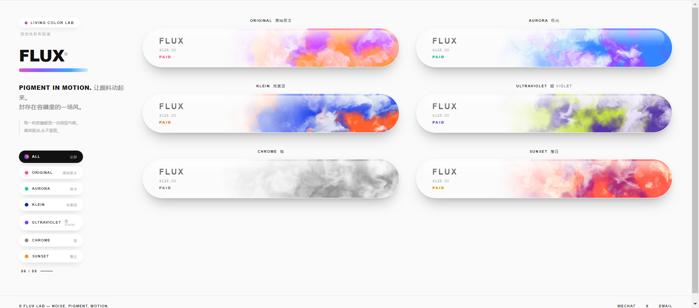

# FLUX — shuke Lab

让固定容器里的颜色材质"活"起来 🎨 — 一个纯前端的 WebGL 流体色彩演示页面。

胶囊形卡片内的彩色云雾由噪声驱动,持续缓慢流动,像封存在容器里的一场风。

## 效果演示

烟雾在 iOS 风格玻璃胶囊里持续流动:



页面全览(左侧筛选栏 + 六种配色主题):



## 预览

直接用浏览器打开 `index.html`,或起一个本地静态服务:

```bash
# 任选其一
python -m http.server 8899
npx serve .
```

然后访问 `http://localhost:8899/index.html`。

无需构建、无任何依赖,单文件即可运行。

## 功能

- **6 种配色主题**:ORIGINAL 原始版本 / AURORA 极光 / KLEIN 克莱因 / ULTRAVIOLET 超紫 / CHROME 铬 / SUNSET 落日
- **iOS 风格玻璃胶囊**:完全药丸形 + 顶部镜面高光带 + 内圈光与体积阴影
- **左侧筛选**:点击主题按钮可单独查看某一张卡片,计数器同步更新
- **悬停交互**:鼠标移入卡片,流速平滑微加速、卡片上浮
- **搅动交互**:鼠标在胶囊内移动,烟雾流速随移动速度加快(最高约 4 倍),停下后约 1 秒平滑回落

## 实现原理

每张卡片内嵌一个独立的 WebGL 画布,核心是片元着色器:

1. **域扭曲 FBM 噪声(Domain-Warped FBM)** — 两层 5 阶分形噪声互相推挤,产生水彩云雾般的自然纹理;
2. **三色混合** — 每个主题由 3 个主色 uniform 传入,按噪声值平滑插值;
3. **白色蒙版** — 卡片左侧约四成渐隐留白给文字,顶部叠加淡淡白雾;
4. **逐帧累积时间** — JS 侧 `flowTime += dt * speed`,悬停变速时画面完全连续,不会跳变;
5. **随机初相位** — 每张卡片的噪声种子与起始时间不同,花纹永不重复。

## 文件结构

```
.
├── index.html   # 页面 + 样式 + WebGL 着色器 + 交互逻辑(单文件)
├── assets/
│   ├── demo.gif     # 动态效果演示
│   └── preview.png  # 页面截图
└── README.md
```

## 自定义

打开 `index.html`,在 `CARDS` 数组中即可增删主题:

```js
{ id: 'sunset', en: 'SUNSET', cn: '落日', paid: '#e0a030',
  colors: [[1.00,0.72,0.18],[1.00,0.34,0.28],[0.62,0.14,0.44]] }  // RGB 0~1,三个主色
```

流速在 `tick(dt)` 中调整:

```js
flowTime += dt * (0.22 + eased * 0.28);  // 0.22 静止流速,悬停加速至 0.50
```

## License

MIT  欢迎start
